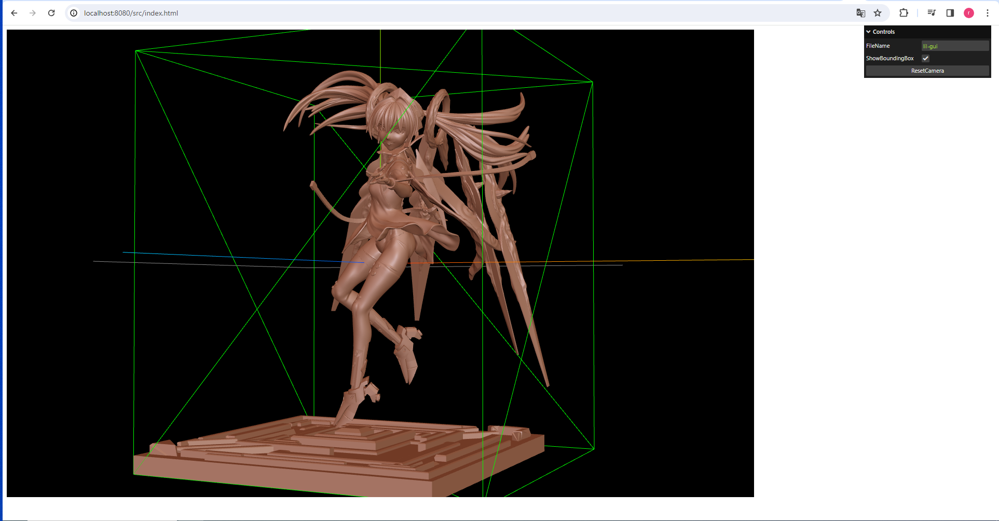

ZBrushで作成したモデルを表示するWebページ 
3Dプリント用モデルを試しに閲覧する想定 
モデルは単一のマテリアルで表示し、テクスチャは考慮しない 

**画面**

個人用メモ 

**環境構築** 
$ npm install http-server 
$ http-server 

**ZBrush export files** 
1. 表示モデルを1つのサブツールにマージ 
   *Zplugin -> SubTool Master -> Merge* 
   MergeOnly にチェック 
2. *Zplugin -> DecimationMaster* でデシメーションかける 
   この時ある程度雑にデシメしておくと、サーバ公開した際にモデルを盗まれても直接問題なさそう 
   1 で一体化しているので型も考慮しない感じにしておくと〇 
3. *Zplugin -> FBX ExportImport* でモデルエクスポート 

**要調査** 
Three.js 内でロードするモデルを盗まれないようにするにはどうすればよいか？ 
